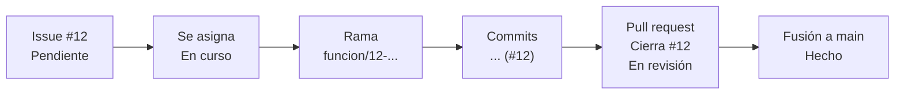

# Trabajo en equipo

Cómo trabajan cuatro personas sobre el proyecto sin pisarse, con el mismo
código, el mismo entorno y los mismos datos, y cómo se hacen las pruebas
conjuntas.

## 1. Qué comparte el equipo

| Qué | Dónde | Cómo se mantiene igual para todos |
|---|---|---|
| Código | Repositorio `makius1/gestion_cartera` en GitHub | Todo cambio entra a `main` por *pull request* y solo si pasan las pruebas automáticas |
| Entorno de desarrollo | GitHub Codespaces | `.devcontainer/devcontainer.json` crea el mismo Python 3.11 con las mismas librerías para todos |
| Conexión a la base | Secretos de Codespaces del repositorio | `DATABASE_URL` y `SEUDONIMO_CLAVE` llegan solos a cada Codespace; nadie los copia a mano |
| Base de pruebas conjuntas | Supabase | Una sola base: todos ven las mismas cargas, gestiones, planes y usuarios |
| Aplicación de pruebas | Streamlit Community Cloud | Se publica desde `main`: una sola dirección, siempre con la última versión aprobada |
| Observaciones, mejoras, cambios y errores | *Issues* y tablero de *Projects* en GitHub | Todos los registran con la misma plantilla; cada uno tiene responsable, estado y los commits que lo resolvieron |

La clave de seudónimos (`SEUDONIMO_CLAVE`) tiene que ser la misma para todos.
Con una clave distinta, las cuentas registradas por esa persona tendrían
códigos que no coinciden con los de la base.

---

## 2. Configuración inicial (una sola vez)

### Lo hace el dueño del repositorio

1. **Invitar a los integrantes:** *Settings → Collaborators → Add people*, con
   permiso de escritura (*Write*). Los secretos de Codespaces solo llegan a
   cuentas con ese permiso.
2. **Proteger la rama `main`:** *Settings → Rules → Rulesets → New ruleset →
   New branch ruleset*:
   - *Ruleset name:* `Proteger main`. *Enforcement status:* **Active**.
   - *Bypass list:* vacía. Si el dueño se agrega ahí, puede saltarse las
     reglas y la protección pierde sentido.
   - *Target branches → Add target → Include default branch*.
   - **Restrict deletions** y **Block force pushes**.
   - **Require a pull request before merging**, con *Required approvals* en 1
     y **Dismiss stale pull request approvals when new commits are pushed**:
     si el autor cambia algo después de la aprobación, hay que volver a
     aprobar.
   - **Require status checks to pass**, con **Require branches to be up to
     date before merging**, y en *Add checks* agregar **Pruebas**. La
     verificación aparece en la lista después de que las pruebas hayan corrido
     al menos una vez.
3. **Confirmar los secretos de Codespaces:** *Settings → Secrets and variables →
   Codespaces*, con `DATABASE_URL` y `SEUDONIMO_CLAVE`.
4. **Publicar la aplicación de pruebas** en Streamlit Community Cloud (pasos en
   el README), con los mismos dos secretos.
5. **Crear un usuario de la aplicación para cada integrante**, con un rol
   distinto para poder probar todos los flujos:

   | Integrante | Rol en la aplicación |
   |---|---|
   | 1. David | Administrador |
   | 2. Juan Pablo | Supervisor |
   | 3. Francy | Gestor |
   | 4. Sean | Gestor |

   Cada persona usa su propio usuario. Así la auditoría y la traza de trabajo
   muestran quién hizo cada cosa, igual que en una operación real.
6. **Crear las etiquetas** en *Issues → Labels → New label*: `error`,
   `mejora`, `observacion` y `pruebas`. Las plantillas las ponen solas, pero
   solo si existen.
7. **Crear el tablero del equipo:** pestaña *Projects → New project → Board*,
   con las columnas *Pendiente*, *En curso*, *En revisión* y *Hecho*, y
   vincularlo al repositorio. En la configuración del tablero, activar el
   flujo que agrega solos los *issues* nuevos a *Pendiente*.

### Lo hace cada integrante

1. Aceptar la invitación al repositorio (llega por correo).
2. En el repositorio: **Code → Codespaces → Create codespace on main**.
3. Cuando termine de crearse, verificar en la terminal:

   ```bash
   python -m datos.base_datos probar
   ```

   Debe decir *PostgreSQL en Supabase (pooler)* y mostrar las tablas con datos.
   Si dice *SQLite local*, el Codespace se creó antes de que existieran los
   secretos: reconstruirlo con `F1` → **Codespaces: Rebuild Container**.

---

## 3. Flujo de trabajo diario

Nadie trabaja directamente sobre `main`. Cada tarea va en su propia rama.

### Quién puede tocar `main`

Nadie sube cambios directo a `main`, ni siquiera el dueño del repositorio.
`main` solo cambia cuando se fusiona un *pull request* aprobado por otro
integrante y con las pruebas en verde. Es la versión que publica Streamlit
Cloud y la que todos prueban, así que siempre debe funcionar.

| Acción | Dueño (*Admin*) | Integrantes (*Write*) |
|---|---|---|
| Subir commits directo a `main` | No | No |
| Crear ramas y subirlas | Sí | Sí |
| Abrir *pull requests* | Sí | Sí |
| Aprobar un *pull request* | Solo los de otros | Solo los de otros |
| Fusionar un *pull request* aprobado y en verde | Sí | Sí |
| Borrar `main` o reescribir su historia | No | No |
| Cambiar reglas, secretos y colaboradores | Sí | No |

GitHub no deja que alguien apruebe su propio *pull request*: todo cambio, incluso
los del dueño, lo revisa al menos otra persona. Por acuerdo del equipo, el
**autor** fusiona su *pull request* una vez aprobado, porque es quien sabe
cuándo está listo.

Si algo fusionado daña `main`, no se corrige con *force push*: en el *pull
request* fusionado se pulsa **Revert**, lo que abre otro *pull request* que
deshace el cambio y pasa por las mismas reglas.

**Antes de empezar**, traer lo último:

```bash
git checkout main
```

```bash
git pull
```

**Crear la rama de la tarea**, con el número del *issue* y un nombre que diga
qué se hace:

```bash
git checkout -b funcion/12-modelo-propension
```

| Prefijo | Para qué |
|---|---|
| `funcion/` | Una funcionalidad nueva |
| `correccion/` | Arreglar un error |
| `documentacion/` | Solo documentos |
| `pruebas/` | Solo pruebas |

**Trabajar y guardar por pasos.** Un commit por módulo o por caso, con un
mensaje impersonal que diga qué se hizo:

```bash
git add motor/base_conocimiento.py
```

```bash
git commit -m "Se agrega la regla de horario para los sabados (#12)"
```

El `(#12)` al final enlaza el commit con el *issue*: en GitHub, el *issue*
muestra todos los commits que lo tocaron.

**Subir la rama:**

```bash
git push -u origin funcion/12-modelo-propension
```

**Abrir el *pull request*** en GitHub (aparece un botón *Compare & pull
request*), llenar la plantilla y asignar a un compañero como revisor.

**Revisión:** GitHub corre las pruebas automáticas sobre la rama. El revisor lee
los cambios y los aprueba o pide ajustes. Con la aprobación y las pruebas en
verde, se fusiona a `main` y se borra la rama.

**Después de cada fusión**, todos traen `main` actualizado antes de seguir
(`git checkout main` y luego `git pull`), y los que tengan una rama abierta la
actualizan con:

```bash
git merge main
```

### Si aparece un conflicto

Git marca en el archivo las dos versiones entre `<<<<<<<` y `>>>>>>>`. Se deja
la versión correcta (o una mezcla de ambas), se borran las marcas y se
guarda:

```bash
git add archivo_con_conflicto.py
```

```bash
git commit -m "Se resuelve el conflicto con main en archivo_con_conflicto"
```

Si no está claro cuál versión es la correcta, se habla con quien hizo el otro
cambio antes de resolverlo.

---

## 4. Observaciones, mejoras y cambios

Todo lo que alguien quiera anotar sobre el sistema va en un *issue* de GitHub,
no en chats ni en documentos sueltos. Así queda un solo lugar compartido, con
historia, que cualquiera del equipo puede tomar y convertir en commits.

**Registrar:** pestaña *Issues → New issue* y elegir la plantilla:

| Plantilla | Cuándo |
|---|---|
| **Error** | Algo no funciona como debería |
| **Mejora o cambio** | Una funcionalidad nueva o un cambio en una existente |
| **Observación** | Un comentario de una revisión, de una sesión de pruebas o del docente |
| **Sesión de pruebas** | El registro de cada sesión de pruebas conjuntas (sección 7) |

Una observación que requiere trabajo se convierte en una mejora o en un error:
se abre el nuevo *issue*, se enlaza desde la observación (`Ver #15`) y se
cierra la observación.

**Del *issue* al commit:**



1. Quien va a trabajar el *issue* se lo asigna (*Assignees*) y lo mueve a
   *En curso* en el tablero. Así nadie trabaja dos veces lo mismo.
2. Crea la rama con el número del *issue* y hace sus commits terminando en
   `(#12)`.
3. En el *pull request* escribe `Cierra #12`. Al fusionarlo, GitHub cierra el
   *issue* solo y lo pasa a *Hecho*.

**Discusión:** los comentarios sobre una propuesta se hacen dentro del mismo
*issue*, no por fuera, para que la decisión quede escrita junto al cambio.

---

## 5. Reparto por módulos

Cada persona es dueña de un área: la conoce a fondo, revisa los cambios que
otros hagan en ella y es a quien se consulta. Trabajar en el área de otro está
permitido, pero se avisa en el *issue* de la tarea.

| Integrante | Área | Carpetas |
|---|---|---|
| 1. David | Datos, base de datos e infraestructura | `datos/`, `seguridad/`, `config.py`, `.github/`, `.devcontainer/` |
| 2. Juan Pablo | Motor de elegibilidad y base de conocimiento | `motor/`, `docs/ALGORITMOS.md` sección 2 |
| 3. Francy | Segmentación, priorización y modelos (fase 4) | `analisis/`, `decision/` |
| 4. Sean | Gestión, plan de trabajo, aplicación web y pruebas | `gestion/`, `app/`, `pruebas/` |

Lo que está completo y lo que falta en cada área está en
[ESTADO_POR_AREA.md](ESTADO_POR_AREA.md). Para crear en GitHub los *issues* de
esos pendientes y la revisión general de cada área: pestaña *Actions* → **Crear
issues desde una lista** → **Run workflow**. Si un *issue* ya existe, no se
repite.

*Pull requests* pequeños, de una tarea cada uno. Uno de cuarenta archivos no lo
revisa nadie con cuidado.

---

## 6. Bases de datos: compartida y personal

| Base | Para qué | Cómo se usa |
|---|---|---|
| **Supabase (compartida)** | Pruebas conjuntas y demostraciones | Es la que llega por defecto a cada Codespace |
| **SQLite (personal)** | Experimentos propios que no deben afectar a los demás | Anteponer `env -u DATABASE_URL` al comando |

Ejemplo, para correr la aplicación contra una base personal vacía:

```bash
env -u DATABASE_URL python -m streamlit run app/principal.py
```

Esto funciona mientras el Codespace no tenga un archivo `.env` con
`DATABASE_URL`: si lo tiene, el sistema tomaría la cadena de ese archivo. Con
los secretos de Codespaces ese archivo no hace falta.

Reglas sobre la base compartida:

- No se borran tablas ni registros a mano. Las cargas nuevas se suman a las
  anteriores, que es como el sistema guarda la historia.
- Los cambios de estructura solo agregan: el sistema crea las tablas y
  columnas nuevas solo, sin tocar las existentes.
- La prueba automática `python -m pruebas.prueba_aplicacion` crea usuarios de
  prueba y por eso se niega a correr contra Supabase. Se corre con la base
  personal (`env -u DATABASE_URL`) o la corre GitHub en cada *pull request*.

---

## 7. Pruebas conjuntas

Una sesión por semana, o antes de cada entrega, con los cuatro conectados a la
**aplicación de pruebas** (Streamlit Cloud), cada uno con su usuario.

1. Se fusiona a `main` lo que esté aprobado. Streamlit Cloud publica la versión
   nueva sola.
2. Se abre un *issue* con la plantilla **Sesión de pruebas**, que ya trae la
   lista de todos los casos para marcar.
3. Se recorre el [plan de pruebas](PLAN_DE_PRUEBAS.md). Cada caso tiene un rol
   responsable, y el escenario del día simulado se hace con los cuatro a la vez.
4. Cada resultado se marca en el *issue*. Cada falla se registra como un *issue*
   aparte con la plantilla **Error**, y cada idea que surja, con **Mejora o
   cambio** u **Observación**. Todos se asignan al dueño del área.

---

## 8. Seguridad del equipo

- El archivo `.env` y cualquier contraseña nunca se suben al repositorio ni se
  pegan en chats o *issues*. Los secretos viven solo en GitHub y en Streamlit
  Cloud.
- En el proyecto solo hay carteras simuladas. Ningún integrante carga una
  asignación con datos de personas en la base compartida.
- Si un integrante deja el equipo: se le quita el acceso al repositorio, se
  desactiva su usuario en la aplicación (no se borra, para conservar la
  auditoría) y se cambia la contraseña de la base en Supabase, en los secretos
  de GitHub y en Streamlit Cloud.
